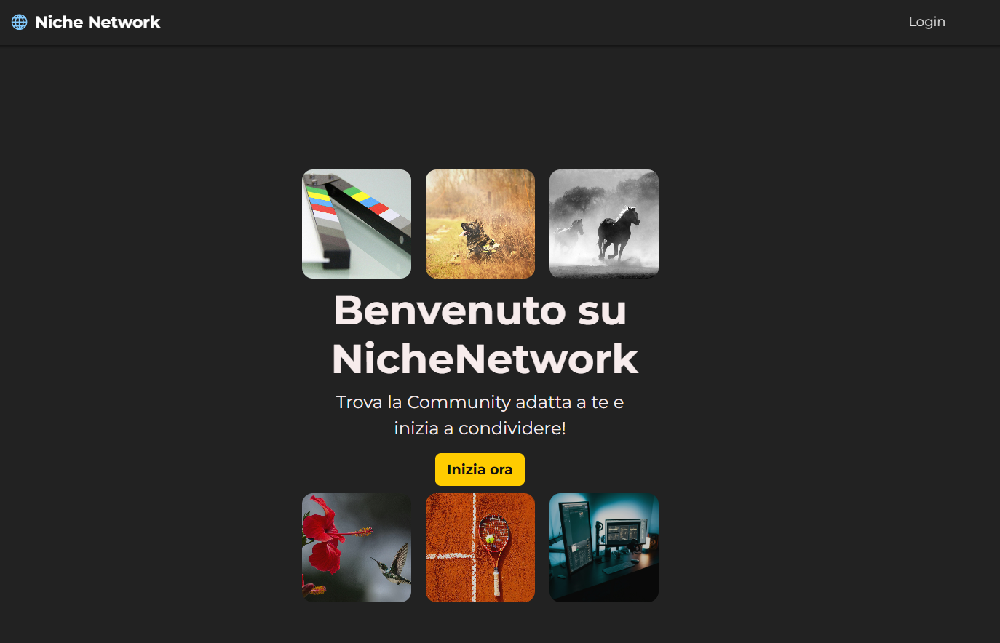
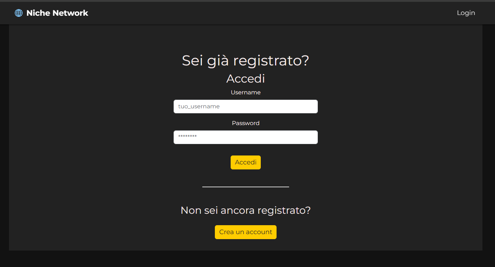
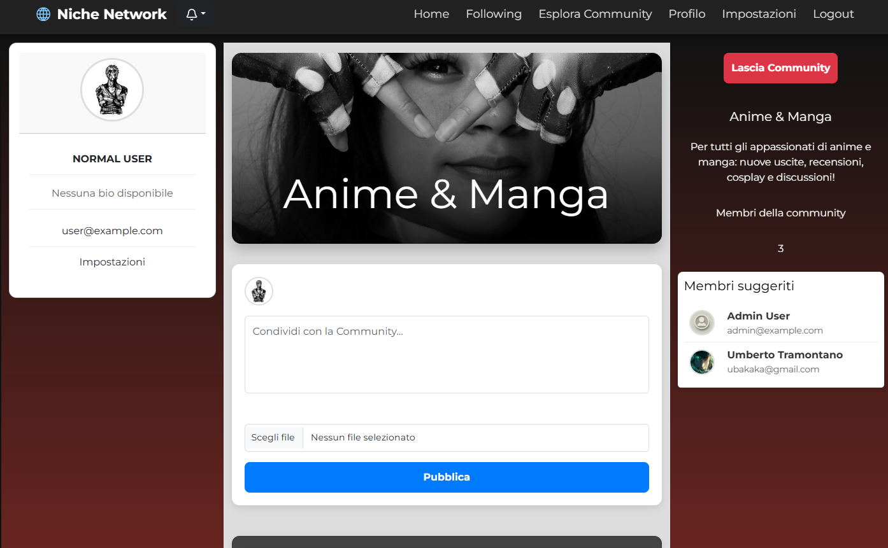
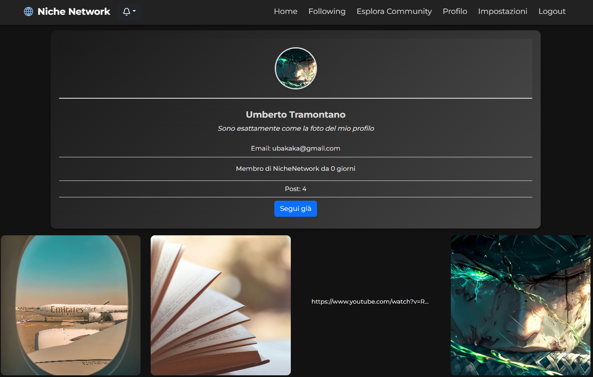
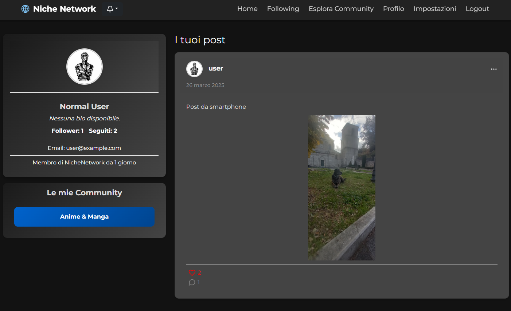
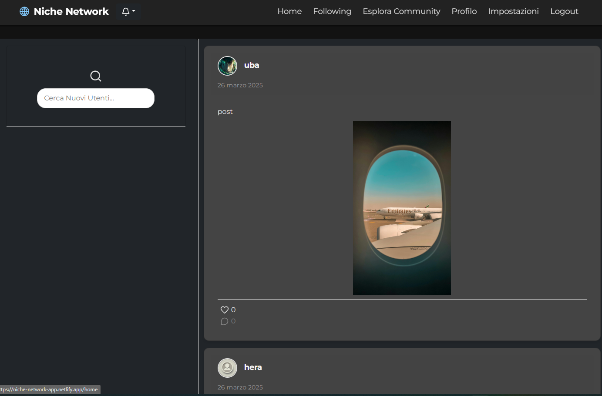

🌐 Niche Network

Niche Network è un social network per community di nicchia, dove gli utenti possono registrarsi, unirsi a community tematiche, creare post, seguire altri utenti, commentare e ricevere notifiche sulle attività principali. Il progetto è stato sviluppato come Capstone finale del corso Full-Stack Developer presso Epicode.

🚀 Tecnologie utilizzate

Backend

Java 17

Spring Boot

Spring Security (JWT)

Spring Data JPA

PostgreSQL

Cloudinary (upload immagini)

Frontend

React + Vite

React-Bootstrap

React Router DOM

Axios

Deploy

🌐 Backend: Koyeb

💻 Frontend: Netlify

🔗 Demo live

🟢 Frontend: https://niche-network-app.netlify.app

🛠 Backend API: https://renewed-philomena-nichenetwork-60e5fcc0.koyeb.app

📂 Struttura progetto

📁 nichenetwork-capstone
├── 📁 backend -> codice Spring Boot + PostgreSQL
├── 📁 frontend -> codice React + Vite
└── 📄 README.md -> questo file

🧪 Come eseguire il progetto in locale

🔧 Backend

Clona il progetto:

git clone https://github.com/tuo-username/nichenetwork-capstone.git
cd nichenetwork-capstone/backend

Configura application.properties con le tue credenziali PostgreSQL.

Avvia il server:

mvn spring-boot:run

Il backend sarà disponibile su http://localhost:8080

💻 Frontend

Vai nella cartella frontend:

cd ../frontend

Installa le dipendenze:

npm install

Crea un file .env e imposta la variabile:

VITE_API_URL=http://localhost:8080

Avvia il client:

npm run dev

Il frontend sarà disponibile su http://localhost:5173

🔑 Funzionalità principali

Registrazione / Login con JWT

Creazione e gestione delle community

Sistema ruoli: ADMIN, USER

Feed post per community

Commenti ai post

Sistema di like ai post

Follow/Unfollow

Notifiche (commenti, like, nuovi follower)

Modifica profilo e avatar

Sistema di ricerca utenti

📦 Repository originali (con storico completo)

Le repository complete di versionamento (branch develop, feature branch, commit semantici, ecc.):

🔧 Backend con Spring Boot👉 https://github.com/uba92/nichenetwork-backend

🎨 Frontend con React + Vite👉 https://github.com/uba92/nichenetwork-frontend

Queste repo documentano l'intero processo di sviluppo, ideazione e deploy continuo (CI/CD) del progetto Niche Network.

| Pagina         | Screenshot                                  |
| -------------- | ------------------------------------------- |
| Landing Page   |        |
| Login          |            |
| Feed Community |    |
| Profilo Utente |   |
| My Profile     |     |
| Register       |      |
| Following feed |  |

📜 Licenza

Questo progetto è open-source sotto licenza MIT.
